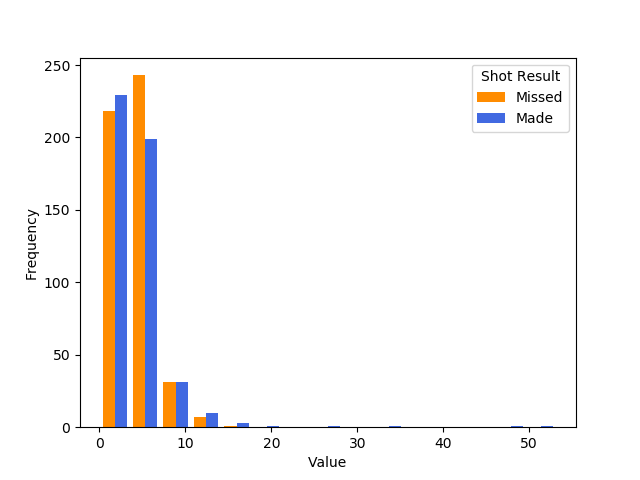
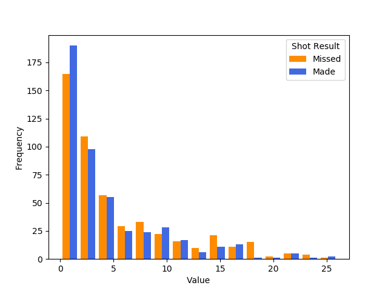
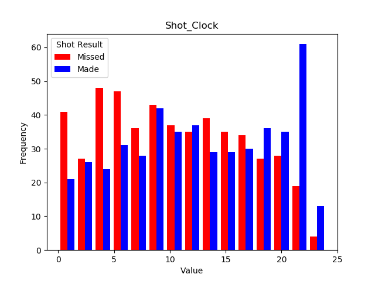
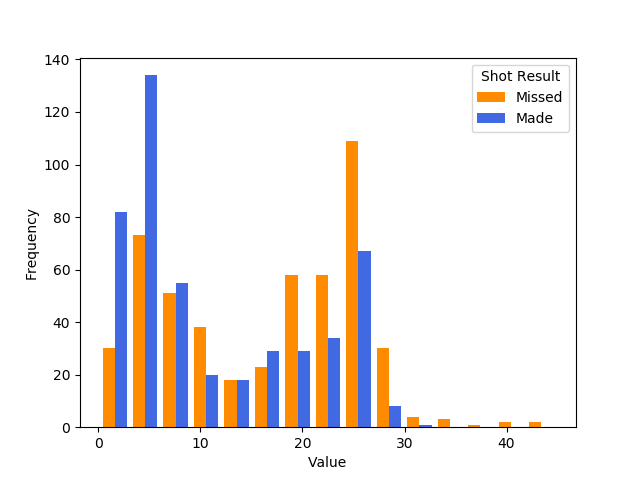
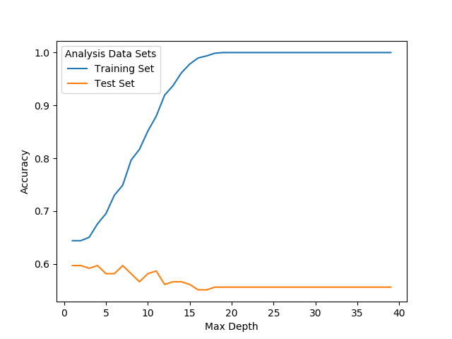
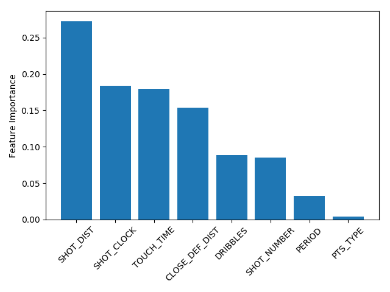

Report
======

A Classification Decision Tree for Lebron James’s Shots
=======================================================

A project for UBC DSCI 522

Authors: Alex Hope, Jes Simkin Nov, 2018

Question
--------

Considering there are hundreds of players in the NBA with differing
skillsets and styles of play, we narrowed our analyses to simply a
single player, Lebron James. We did this to hopefully get at the nuances
of what conditions best explain Lebron’s shooting percentage and
marvellous talent. Our question is a predictive one, namely, we are
interested in using a set of measurements to predict another measurement
about a single individual.

Our question for this analysis is:

**What are the three strongest predictors for determining whether Lebron
makes or misses a shot?**

[GIF
Source](https://media.giphy.com/media/l0MYwdebx8o0XI56E/giphy-tumblr.gif)

Exploring The Data
------------------

We have chosen 8 features in our dataset related to aspects of shooting
that are numerical. To get a sense of the features and build our
intuition around which are our top predictors, we explored the
distribution of each feature grouped by shot result (made or missed).

The features we considered when attempting to predict the success and failure of Lebron's shots were: shot distance, shot clock, touch time, closest defender distance, shot number, dribbles, period (quarter), points type (2 or 3 point shot). In the interest of keeping this report succint, we have provided histograms for a few of the features we included in our analyses.

### Figure 1. Closest Defender (ft):

Figure 1: There appears to be little discrepancy within the distribution
of `Closest Defender Distance` based on made or missed and the majority
of the values fall between 0 and 5.

### Figure 2. Number of Dribbles:

Figure 2: There also seems to be very little to distinguish between the
distributions for made and missed based on the number of dribbles. While
there is a significant dispersion, it doesn’t seem to vary much by group
(made or missed).

### Figure 3. Time on the Shot Clock (seconds):

Figure 3: Interestingly, the extremes of this histogram suggest a fairly
significant group difference in whether a shot was made or missed. In
the context of basketball, typically when the shot clock is low, players
are more often rushing their shots or taking their shots in situations
that aren’t ideal and would lead to greater likelihood of a miss, which
is what this histogram seems to display. However, the opposite is true
for when lots of time exists on the shotclock where made is extremely
high.

### Figure 4. Shot Distance (ft):

Figure 4: Shot Distance also seems to hold a significant variation at
the extremes where shots that have a shorter distance are more often
made than missed, and shots from a far distance more often miss.

Analysis
--------

### Figure 5. How our model performs:

Figure 5: Here we see a contrast between both our training and testing performance for Lebron's data. We have chosen a depth of 6 in that our peak testing performance was at this depth, and while the training accuracy is still climbing rapidly it is early enough to suggest the model hasn't been overfitted.

### Figure 6. Feature Ranking:

 

Figure 6: Here we have ranked our features in order of importance, meaning the relative amount they contributed to the overall performance of the model. This is to say, all of the features will add up to 1 when added, however, their contribution to the 59% score will differ. As you can see the most prominent features for our decision tree were shot distance, shot clock and touch time.

 

<a href="https://media.giphy.com/media/lKafiHISf6FEtciruw/giphy.gif">GIF
Source</a>

Observations
------------

Our best tree depth was a depth of 6 with a test set accuracy of 59% for
predicting whether Lebron James makes or misses a shot. To address our question, the three most powerful predictors in classifying the target of interest (make or miss) were shot distance (shot_dist), shot clock (shot_clock) and touch time (touch_time). These made the largest overall contribution to the classification of targets in our testing set.

We were surprised by the limitations of our features in predicting
whether Lebron makes a shot or not. At accuracy for prediction, that’s
slightly more than a coin toss. One point we hadn’t clearly thought
about is that Lebron seems to be a strong shooter even when changes in
these variables of interest happen. For instance, he is known for being
an excellent long distance shooter and for making shots even when the
defender is close by. Therefore, his targets are harder to predict
because the reasons he misses aren’t as cleanly captured given the
features we have outlined here. We suspect that if another shooter was
chosen who is not a perimeter shooter, and really only scores in and
around the hoop, we may find some of these features to be more
predictive of the target variable.

There may be other features that aren’t captured in this dataset or have
yet to be developed that help distinguish Lebron’s makes and misses.
While our analysis was limited in it’s predictive power, this process
has helped encourage us to think about feature development in new ways
to measure the game that haven’t been considered like fan noise, points
the team is up or down when the shot was taken, and player stamina.

If we had more time, we could consider testing out other players to see
whether our decision tree is able to differentiate targets more clearly.
Can we get a better prediction rate with other players? Perhaps with
players with a worse shooting percentage whose misses predictably occur
through one of the features we have discussed?

There are lots of questions to explore in the future with this work, and
we have learned a great deal from this process about the challenges of
prediction, and the strengths/weaknesses of decision trees.

References
----------

-   Lebron James Shot Log from the 2014-2015 NBA Season. Raw Data
    Source: [Kaggle, NBA Shot Logs
    Dataset](https://www.kaggle.com/dansbecker/nba-shot-logs/home)
-   Data Analysis Pipeline Example by Tiffany Timbers for UBC DSCI
    522 (2018) [Github
    Repo](https://github.com/ttimbers/data_analysis_pipeline_eg/tree/v1.1)
-   Feature Importance by Chris Albon [Blog
    Link](https://chrisalbon.com/machine_learning/trees_and_forests/feature_importance/)
