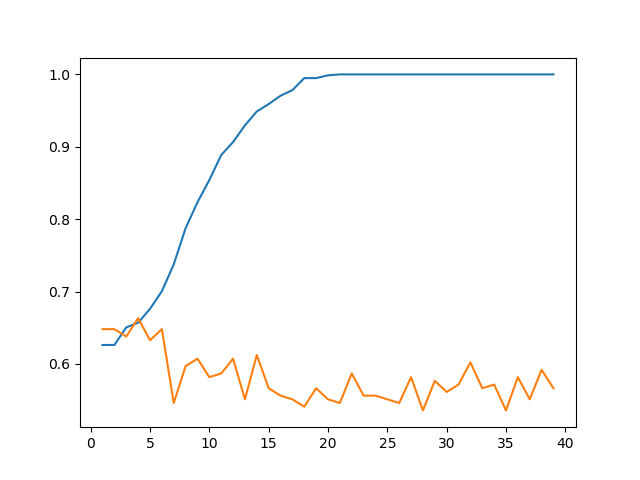
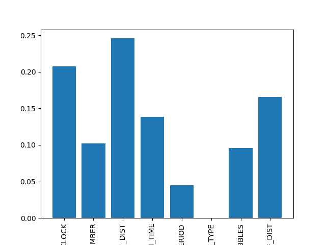

Report
================

A Classification Decision Tree for Lebron James's Shots
=======================================================

Authors: Alex Hope, Jes Simkin Nov, 2018

Question
--------

Considering there are hundreds of players in the NBA with differing skillsets and styles of play, we narrowed our analyses to simply a single player, Lebron James. We did this to hopefully get at the nuances of what conditions best explain Lebron's shooting percentage and marvellous talent. Our question is a predictive one, namely, we are interested in using a set of measurements to predict another measurement about a single individual.

Our question for this analysis is:

**What are the three strongest predictors for determining whether Lebron makes or misses a shot?**

[GIF Source](https://media.giphy.com/media/l0MYwdebx8o0XI56E/giphy-tumblr.gif)

Exploring The Data
------------------

We have chosen to work with 8 features. To get a sense of the features and build our intuition around which might end up being top predictors, we explored the distribution of each feature, grouped by shot result (made or missed).

Closest Defender (ft): 

Number of Dribbles: 

Period in a Game: 

Type of Shot (2-point, 3-point): 

Time on the Shot Clock (seconds): 

Shot Distance (ft): 

Shot Number: 

Touch Time (seconds): 

Analysis
--------

### How our model performs:

### Top Three Features:

.

[GIF Source](https://media.giphy.com/media/lKafiHISf6FEtciruw/giphy.gif)

Observations
------------

Our best depth was 11 with a test set accuracy of 60% for predicting whether Lebron James makes or misses a shot.

We were surprised by the limitations of our features in predicting whether Lebron makes a shot or not.

It appears that there might be other features to consider, or that there's more to the beautiful game of basketball than can't be encoded.

\[Insert what might consider doing differently here\]

References
----------

-   Lebron James Shot Log from the 2014-2015 NBA Season. Raw Data Source: [Kaggle, NBA Shot Logs Dataset](https://www.kaggle.com/dansbecker/nba-shot-logs/home)
-   Data Analysis Pipeline Example by Tiffany Timbers for UBC DSCI 522 (2018) [Github Repo](https://github.com/ttimbers/data_analysis_pipeline_eg/tree/v1.1)
-   Feature Importance by Chris Albon \[link\] (<https://chrisalbon.com/machine_learning/trees_and_forests/feature_importance/>)
